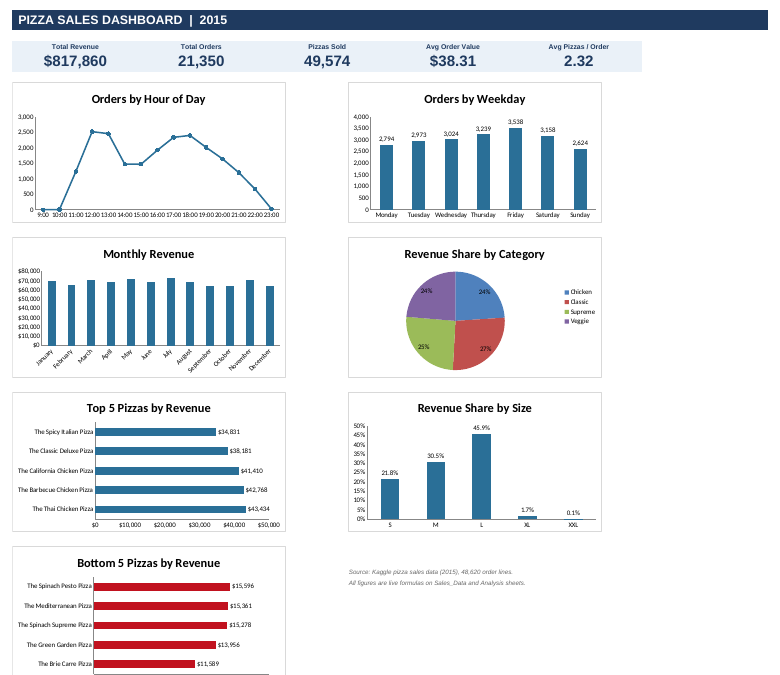
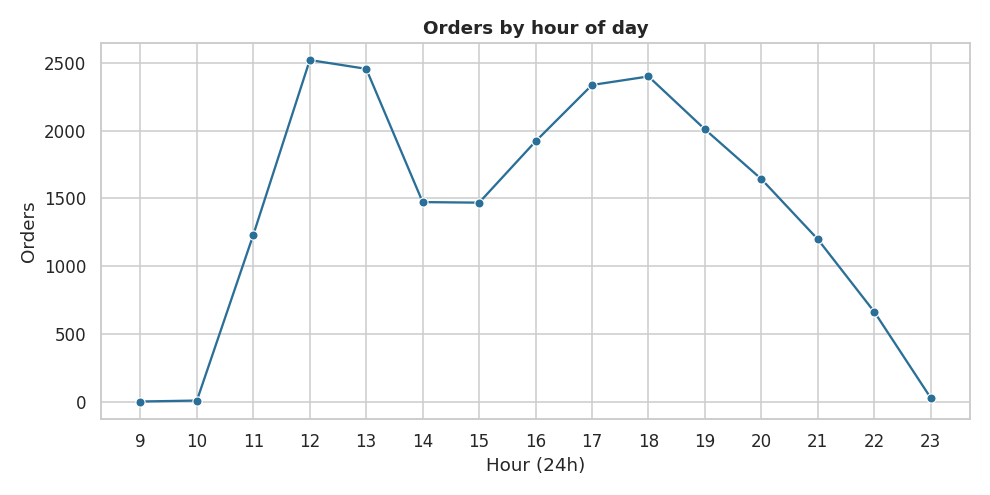
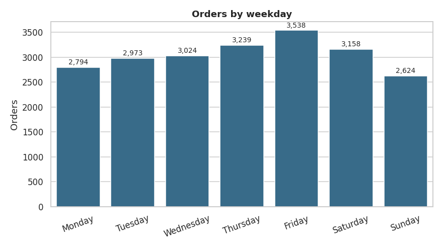
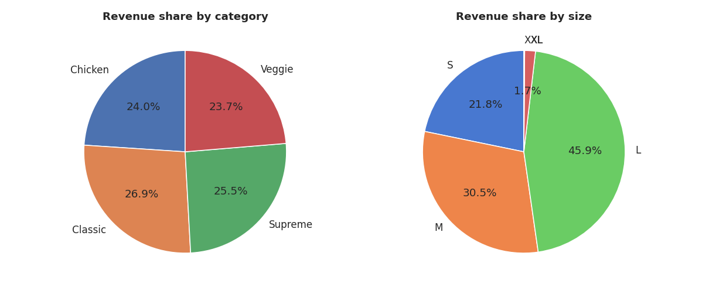
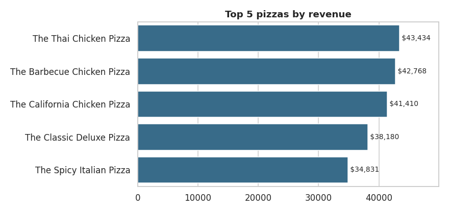

# Pizza Sales Analysis (2015)

An end-to-end analytics project using **Python (Pandas, NumPy, Matplotlib, Seaborn), SQL (MySQL), Excel and Power BI** to understand a pizza restaurant's revenue, demand patterns and best and worst sellers.

**Data:** one year of order lines from a pizza restaurant, 48,620 rows and 12 columns, 21,350 orders (Kaggle; `data/pizza_sales.csv`).



## Business problem
Management wants to know how the business performed in 2015: how much it sold, when demand peaks, which categories and sizes earn the most, and which menu items should be promoted or reviewed.

## Headline results
| KPI | Value |
|---|---|
| Total Revenue | $817,860 |
| Total Orders | 21,350 |
| Total Pizzas Sold | 49,574 |
| Average Order Value | $38.31 |
| Average Pizzas per Order | 2.32 |

**Key findings**
- **Peak hours:** lunch is the busiest period; 12:00 to 13:59 accounts for 23.3% of all orders, with a second peak at 17:00 to 18:59.
- **Weekdays:** Friday is the busiest day (about 71 orders per trading day) and Sunday the quietest (about 51).
- **Seasonality:** July is the strongest month by revenue ($72.6K) and October the weakest ($64.0K); monthly revenue is fairly flat (about $64K to $73K).
- **Category:** Classic leads on revenue (26.9%) and on pizzas sold (30.0%); the four categories are within about 3 points of each other in revenue.
- **Size:** Large pizzas make 45.9% of revenue; XL and XXL together are under 2%.
- **Menu:** The Thai Chicken Pizza earns the most ($43.4K) and The Brie Carre Pizza the least ($11.6K). The top 10 of 32 pizzas generate 44.5% of revenue.
- **Baskets:** 38% of orders contain a single pizza and the median order is $32.50 (mean $38.31), so combos and add-ons are the clearest way to lift order value.

## Repository structure
```
README.md
requirements.txt
LICENSE
data/pizza_sales.csv                       source data
notebooks/pizza_sales_analysis.ipynb       cleaning, KPIs, trends, best/worst sellers
sql/pizza_sales_queries.sql                MySQL schema, load script and analysis queries
excel/Pizza_Sales_Dashboard.xlsx           formula-driven dashboard (7 charts)
powerbi/POWERBI_BUILD_GUIDE.md             DAX measures + layout to build the .pbix
images/                                    charts exported from the notebook
```

## Sample charts
| Orders by hour | Orders by weekday |
|---|---|
|  |  |

| Revenue by category and size | Top 5 pizzas by revenue |
|---|---|
|  |  |

## Method
1. **Data quality:** no nulls or duplicate line IDs, `total_price = unit_price x quantity` on every row, one timestamp per order. Dates are dd-mm-yyyy and were parsed explicitly. The file covers 358 trading days.
2. **KPIs:** calculated independently in Python, SQL and Excel. Orders are counted as *distinct* `order_id`, because an order has several rows.
3. **Trends:** hour, weekday, month and ISO week.
4. **Product mix:** category, size, top and bottom 5 by revenue, quantity and orders, plus a revenue concentration check.
5. **Validation:** all three tools return the same figures.

| Metric | Python | SQL (MySQL) | Excel |
|---|---|---|---|
| Total Revenue | 817,860.05 | 817,860.05 | 817,860.05 |
| Total Orders | 21,350 | 21,350 | 21,350 |
| Pizzas Sold | 49,574 | 49,574 | 49,574 |
| Avg Order Value | 38.31 | 38.31 | 38.31 |
| Avg Pizzas / Order | 2.32 | 2.32 | 2.32 |

## How to run
- **Python:** `pip install -r requirements.txt`, then open the notebook.
- **SQL:** run `sql/pizza_sales_queries.sql` in MySQL Workbench. The CSV uses Windows line endings and dd-mm-yyyy dates; the commented `LOAD DATA` statement already handles both. Enable `local_infile`, or use the import wizard and convert dates afterwards.
- **Excel:** open the workbook. It holds about 195K formulas, so the first open and recalculation can take a few seconds.
- **Power BI:** follow `powerbi/POWERBI_BUILD_GUIDE.md`.

## Data source
Pizza sales data from Kaggle. Check the dataset's license before redistributing the CSV.

## Limitations
One year, one restaurant, no customer IDs, costs or margins, so findings describe sales, not profit. About 7 days have no orders in the file.

## Recommendations
Staff for the lunch and early-evening peaks, run offers on Sunday and other slow days, review the bottom-5 pizzas, and use combos to raise average order value.

## Author
**Nikhil Kumar** · B.Tech CSE, CMR University · nikhilkumarsingh1366@gmail.com
